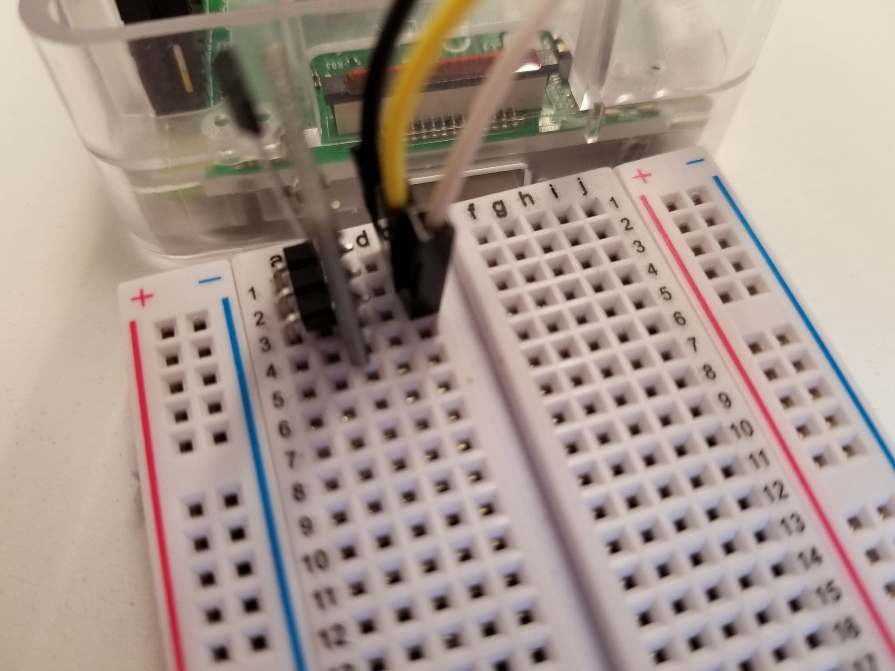
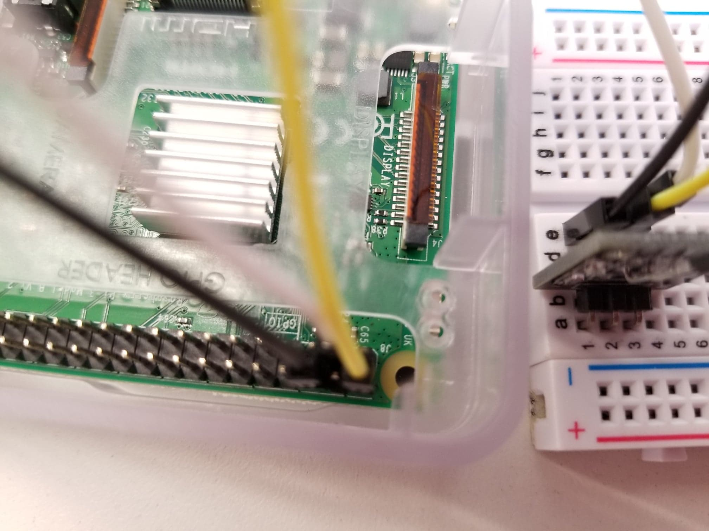

# Bikeathon

The main repository for Alpha Tau Omega at Carnegie Mellon's Bikeathon event

# Flask Config

There are a couple attributes defined in the top-level `config.py` file. The only attributes you may need to change are the email ones. It is setup by default to handle Google Mail, so any gmail or G Suite (like CMU andrew emails) should work fine by default and not require changes, but if you use a different mail provider then you should look up the appropriate attributes to use for Flask Mail for your email service.

You will need to create a file named `config.json` in the top level directory with the following entries:

```json
{
    "GSHEETS_KEY": "spreadsheet-key",
    "MAIL_PASSWORD": "email-password",
    "MAIL_USERNAME": "your-email@gmail.com",
    "POST_PASSWORD": "make-one-up",
    "STRIPE_API_KEY": "get-from-stripe",
    "URL": "https://bikeathon.cmuato.org",
    "VENMO_TOKEN": "set-by-venmo-configure"
}
```

The GSheets Key is the spreadsheet key for the Google Sheet that contains the Google Form data. You can Google "how to find google spreadsheet key."

The Post Password is just a simple password used by the Raspberry Pis and checked by the back-end to make sure no one is tampering with the distance data by making a bunch of posts to the server to add distance and mess things up. Obviously not the most secure but it should get the job done.

You should get the Stripe API key from the stripe website, change the URL if the app gets hosted somewhere else, and don't worry about the Venmo token since that'll be set later on.

## Google Mail

If you would like to use Gmail to send emails, you will need to take a few steps to get authentication working properly.

Gmail has some strict security protocols that this flask app cannot adhere to, so you will need to turn on the setting to allow "less secure apps" to access your account (find this in the Google Account settings). If this doesn't work, you may also need to visit [this link](https://accounts.google.com/b/0/DisplayUnlockCaptcha) (make sure the number in the url bar following the `/b/` is the number you see in the url bar when in your account's gmail following the `/u/` and change it if necessary), click continue, then try sending another email from the application. This may or may not work long-term, so keep an eye out for it starts to fail again in the near future. Another potential solution is to try enabling IMAP access [here](https://mail.google.com/mail/#settings/fwdandpop).

Alternatively, if your account has 2 Factor Authentication turned on, you will need to generate an [app password](https://support.google.com/accounts/answer/185833) and use that in place of your account password above. This will not require the "less secure apps" setting.

Additionally, you may also use whatever G Suite domain you have for Google Mail. For example, CMU students may use your @andrew.cmu.edu email. To set this up, follow the instructions at [this page](https://www.cmu.edu/computing/services/comm-collab/email-calendar/google/how-to/index.html "this page") titled "How to Use Google Mail" in the section about setting up an email client and set a G Suite password, which you will use as the password in the config secrets file. This might require the "less secure apps" setting mentioned above.

## Google Sheets

This application uses the Python Google Sheets API to track data recorded in the manual donation form (for cash). First, create the Google Form that you will be using (or just make a copy of an existing one). This form's first field should be a donation amount (in dollars), followed by a multiple choice for method of payment (between "Cash" and "Misc"), and then lastly usually a memo field for comments. Then make a spreadsheet of the responses. In that spreadsheet, make a new sheet titled "Data" and either copy the labels and formulas from an existing sheet or populate it as such:

- The first row has "Method" and then "Total".
- Below Method is "Cash" and then "Misc".
- Below Total are the following two formulas
    - SUMIF('Form Responses 1'!C:C,A2,'Form Responses 1'!B:B)
    - SUMIF('Form Responses 1'!C:C,A3,'Form Responses 1'!B:B)

It's probably a good idea to select "Protect sheet" for both of these sheets so that you don't accidentally mess up the data.

Once the sheet is set up, you will need to make sure you have an account with the Drive and Sheets APIs enabled. For this process you can follow this decent [walkthrough](https://medium.com/@denisluiz/python-with-google-sheets-service-account-step-by-step-8f74c26ed28e) up until you download the JSON and share the spreadsheet with your credential. MAKE SURE you literally share the spreadsheet with the weird email that you get out of the process in this walkthrough, since that it how the app gets access to it.

Lastly, find the JSON you downloaded, rename it to `gsheets_secret.json`, and put it in the application/repository directory. Now the application should have access to Google Sheets!

## Venmo

The Venmo is actually pretty easy to set up. Once you clone this repository to your machine and create a `config.json` file, simply run the `venmo_configure.py` script, enter your login information, enter the code from the text you get, and the script will automatically add your authorized token to the config file, ready for use when the application gets running.

IMPORTANT NOTE: these Venmo tokens have short lifetimes (maybe 30 minutes of inactivity). This is ok during the actual event since the token does not expire if it keeps getting used (and the balance gets pinged like every 10 seconds), but while developing, testing, and deploying, you will likely need to re-run the `venmo_configure.py` script to get a new token, as well as run the `config_heroku.py` script discussed below to make sure heroku gets this new token as well.

## Censored Text

As long as the donation button form accepts a Name field, making sure that field is censored is an appropriate measure (since bad actors could put vulgar language in the name field and someone else's email, making us send vulgar language to an innocent person). You will need to find a suitable list of censored words and put them into a file called `censored.txt` in the root directory, one word/phrase per line.

## Local Testing

Before deploying the application, you should test it locally to make sure everything works. First, clone this git repository to somewhere on your machine, install the requirements, create and fill `config.json` as well as `censored.txt`, run the `init_db` function from `init_db.py`, and then run `application.py`. Then open the url given in the console and make sure everything looks right.

## Heroku Setup

This application is configured to run with Heroku, which handles deployment of the app. It lets you run limited applications for free, but the paid tier is [really cheap](https://www.heroku.com/pricing "really cheap") (especially if you're only running it for a day). The main benefit of the Hobby plan is getting a custom domain with SSL security (so it can be hosted at bikeathon.cmuato.org, for example), and not having the app fall asleep after 30 minutes.

To get started, set up a Heroku account and install the [Heroku CLI](https://devcenter.heroku.com/articles/heroku-cli "Heroku CLI"). Then open a console or command prompt on your computer and cd over to the repository folder. From there, run the following command, selecting a universally unique name for your application:

```
heroku create bikeathon
```

When that completes, take note of the herokuapp url it gives you. This is where your application will be hosted (at least for now). Then add a database to the application:

```
heroku addons:create heroku-postgresql:hobby-dev
```

Then to set up the environment variables from your `config.json` file on the heroku server, run the following. Remember, you should probably make sure you run `venmo_configure.py` again before doing this since the token may have expired, and any time your token expires you will need to run this heroku config command again:

```
python config_heroku.py
```

Next you will need to head to [heroku.com](http://heroku.com), select your app, head to the Settings tab and click Reveal Config Vars so you can add a few more. First, create a new config var called `GDRIVE_API_CREDENTIALS` and paste in the entire contents of your `gsheets_secret.json` file. Then, create another called `CENSOR_TEXT` and paste in the entire contents of your `censored.txt` file (which may well be very large).

Now to deploy the application, run

```
git push heroku master
```

This will deploy the application. Once that completes, you need to initialize the database on the heroku server. To do that, run

```
heroku run python
```

When the python console opens, run the following commands:

```python
>>> from init_db import init_db
>>> init_db()
>>> quit()
```

Then, head over to the herokuapp url mentioned above, and make sure everything works fine. Make sure it looks right, the numbers update, and try donating and having an email sent to you. Sometimes there are security issues with sending emails once the app has been deployed, so make sure email sending works and fix any problems if they arise.

## Extra Heroku Stuff

Now the application should be fully running on Heroku's free plan. If you want to take advantage of the paid plan, you can do so by logging into [heroku.com](http://heroku.com), going into your app, selecting Configure Dynos and then Change Dyno Type to use a paid dyno. Then you can also set up a custom domain in the Settings tab.

Note: you can use custom domains on free dynos, but those won't have SSL certificates, so https won't work, and since this application handles financial data you need to make sure https works.

# Raspberry Pis

Ideally, the Raspberry Pis won't introduce as many problems anymore as they have in the past. First, obviously, make sure you have a Raspberry Pi and you've installed the OS and it's all set up. Before moving forward, depending on your experience with pis, you may find [this link](http://www.circuitbasics.com/how-to-set-up-a-static-ip-on-the-raspberry-pi/) useful for setting up a static ip on your pi (so that you don't have to find the ip address on the pi itself every time you want to ssh into it).

## Pi Config

You need to clone (or copy) this repository onto your Pi to get it the files it will need to run the sensor program. Once you've done that, you will need to edit the `piconfig.json` file to make sure it is set up properly. That file includes `distance`, `wheel_radius`, and `uid`. Distance should start at 0, but it will be updated as distance is tracked by the Pi during the event as a recoverable copy of the value in case the network connection fails and the Pi needs to reboot. The wheel radius is measured in inches. The UID must be a unique number for every Pi in the event. Currently the application is hardcoded to track two bikes, so the UID must be either 1 or 2, but if you want to change this (either add more bikes or make it support an arbitrary number of bikes) you'll need to change the code in `models.py` and the sensor route in `application.py` to handle more UID's.

## Local Testing

Once you get a bike set up for testing and a strong magnet attached somewhere on the wheel such that it will pass by a good location to plant the sensor, you'll need to connect up the Raspberry Pi to the sensor. These images should be enough to show how to connect the wires to the correct pins of the pi and the hall-effect sensor:





It will probably be best to test the bike now by connecting the sensor, making sure you clone (or copy) this repository onto the pi, and running the `sensor.py` script in a console window on the pi and watching the output as you pedal to see if it counts every pass of the sensor.

## Start on Boot

Once you're ready for the event, you'll want the sensor script to activate on the pi once it boots up so you don't have to start it manually every time you turn in back on. This is easy to do with systemd (based on [this article](https://www.dexterindustries.com/howto/run-a-program-on-your-raspberry-pi-at-startup/#systemd)).

First, copy the `bikeathon.service` file from this repository into the pi's `/lib/systemd/system/` folder. While you're in there, make sure it has the right permissions by running:

```
sudo chmod 644 /lib/systemd/system/bikeathon.service
```

Now to enable this service on the pi, run

```
sudo systemctl daemon-reload
sudo systemctl enable bikeathon.service
```

To make sure it runs on boot-up, restart the pi:

```
sudo reboot
```

# Static Elements

Apart from setting all the tech up, you'll need to make sure the website itself is up to date. The html for this application can be found in two places: `templates` and `docs`. The templates folder contains the page that will be served while the application is live, while the docs folder is just essentially a copy that this repository is configured to serve as a static site for basically the remainder of the year. You should make sure `index.html` in templates is up to date when you deploy the heroku application (don't forget to update your DNS settings to point to the heroku app from your custom domain), and then after the main event is done you should update `index.html` in the docs folder with the total amount of money raised and change your DNS back to this github repository (serving from the docs folder).

And of course, quick maybe obvious note, make sure you update the start and end dates/times in `static/main.js` so that the timer on the site works properly.
